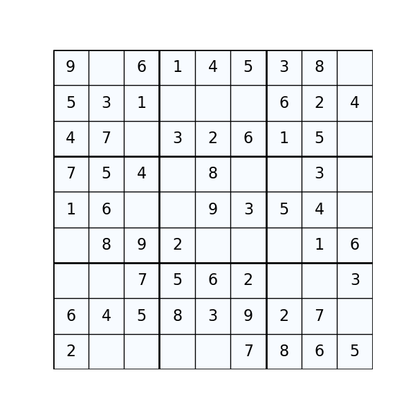

# DEEP SUDOKU

## Overview: Deep Learning Meets Sudoku

This repo holds different utilities for combining deep learning and sudoku.

### Sudoku Generation & Optimization

- Rapid Sudoku Generation: Leveraging the methodology from brotskydotcom's sudoku-generator, our deepsudoku/generate.py facilitates fast generation of Sudoku puzzles across varying levels of difficulty.

- Optimized Sudoku Generation: For high-difficulty puzzles, we've integrated the efficient [tdoku](https://github.com/t-dillon/tdoku/tree/master) solver. This ensures swift generation of hard Sudoku puzzles. We've also equipped this with parallel processing capabilities for maximized efficiency.

### Reinforcement Learning

Located in `deepsudoku/reinforcement_learning`, this segment offers:

- Data Loading Utilities: Comprehensive tools and scripts to simplify the process of loading and preprocessing the Sudoku data.

- Innovative Neural Layer: Introducing the "SudokuDoubleSoftMax" layer, a powerful neural network layer tailored specifically for advanced Sudoku challenges.

- Additional Utilities: We've incorporated model wrappers for training with model.fit and other utilities to make the implementation process smoother and more efficient.

### Supervised Learning for Sudoku

Contained in `deepsudoku/supervised_learning`, this section showcases:

- Supervised Learning Experiments: Dive into our experiments involving various architectures for supervised learning with Sudoku.

- Innovative Layer: Introducing the "SudokuDoubleSoftMax" layer, a novel approach tailored for Sudoku challenges.

## Research Experiments
For our deep reinforcement learning project, we embarked on multiple experiments:

1. Supervised Learning Research: We extensively studied different architectures to gauge their effectiveness in Sudoku solutions. Explore the entire process, from code to logged outcomes, in the `supervised_experiments` directory.

2. Reinforcement Learning Exploration: Delve into our research on the optimal architecture and environment dynamics for reinforcement learning, housed in the `reinforcement_learning_experiment` folder.

3. Benchmarking the Best: Based on our research insights, we trained a agent capable of solving Sudokus with 27 missing digits with an ~60% success rate using maseked PPO. The entire journey can be retraced in `train_best_agent`.

For complete transparency and reproducibility:

- All experiment codes, TensorBoard logs, hyperparameter configurations, and actual bash scripts are provided.
- Results were compiled, analyzed, and can be reviewed in the `stats` and `analysis` directories.

Research Paper: Further details on our experiments are documented in our paper, the link for which will be provided soon.

## Install

### Basic Installation

Install Required Dependencies: Start by installing the necessary dependencies from the [pip_reqs.txt](pip_reqs.txt) file.

    pip install -r pip_reqs.txt

### Reinforcement Learning Dependencies
If you are focusing on the reinforcement learning components, you will additionally need the following:

    torch==2.0.1
    captum==0.6.0

You can install them via pip:

    pip install torch==2.0.1 captum==0.6.0

### Supervised Learning Dependencies
For the supervised learning components, you will require:

    tensorflow==2.13.0

Install using pip:

    pip install tensorflow==2.13.0

### Conda Environments
For those using Conda, we have provided environment configuration files for your convenience:

    sudoku_torch_env.yml: Environment setup for PyTorch-based workflows.
    sudoku_tf_env.yml: Environment setup for TensorFlow-based workflows.

### Optional: TDoku Solver
For faster Sudoku generation, you can install the  [tdoku](https://github.com/t-dillon/tdoku/tree/master) solver. Simply run the provided installation script.

    bash ./tdoku_install.sh